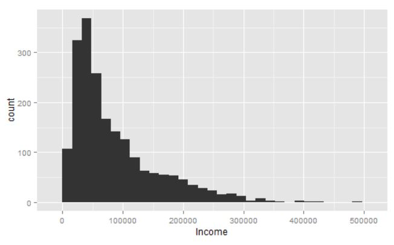
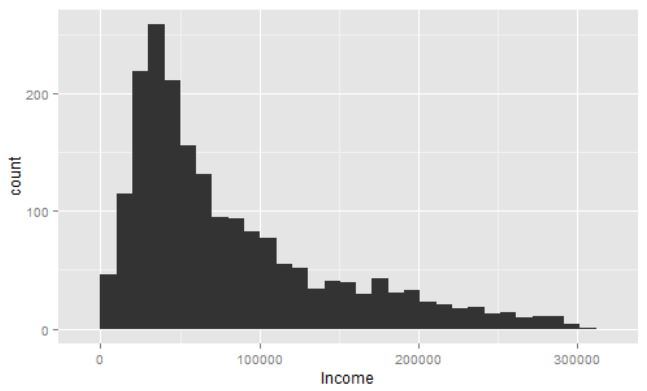
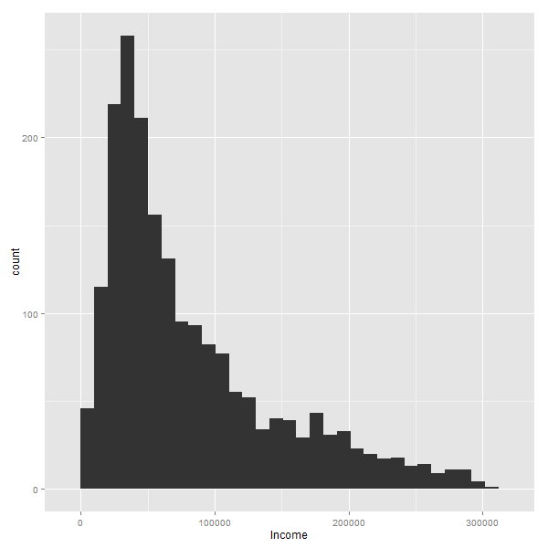
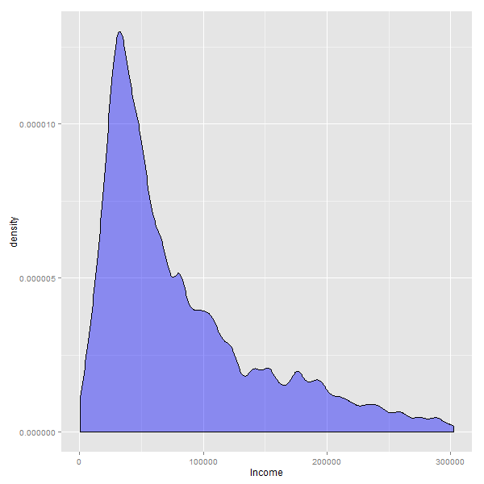

Eliminando outliers
====

### Introducción
Los outliers son los valores extremos que tiene una variable, dependiendo del modelo o requerimiento, puede ser necesario tratarlos ya sea transformando o eliminandolos. 

### Distribución variable "Income"

Observamos como hay pocos valores con valores altos, y muchos con valores bajos.

#### Si elegimos eliminarlos...
Es una pregunta común eleigr cuántos datos dejar afuera, podemos elegir dejar afuera el 1% de los valores mas altos:

La distribución se ve muy similar. Si hacemos este proceso iterativamente -sacando el 1% mas grande, y a ese resultado se le vuelve a sacar el 1%, y asi 10 veces- para analizar distintos valores de punto de corte sucede algo curioso, la silutea se mantiene siempre parecida a:

Aquí una animación que muestra como el siempre se mantiene similar: 

Es decir, siempre habran muchas personas con ingresos bajos/medios, y pocos con ingresos altos. Lo que naturalmente cambian, son los valores de los ejes. 

Si analizamos el gráfico de densidad, el efecto es un zoom en los datos:

En este caso en particular se podría  dejar afuera el 0.5 o 1% de los datos. Aunque no siempre es recomendable eliminar outliers, a veces pueden representar fraudes, un desperfecto en una máquina, u otro evento que merece una inspección mayor.

#### Contacto
Code Available in: https://github.com/pablo14/REPO QUE LE CORRESPONDA
Made by Pablo C. from [Data Science Heroes](http://datascienceheroes.com)
 Curso e-learning: Data Science with R (solicitar demo gratuita en info@datascienceheroes.com)
