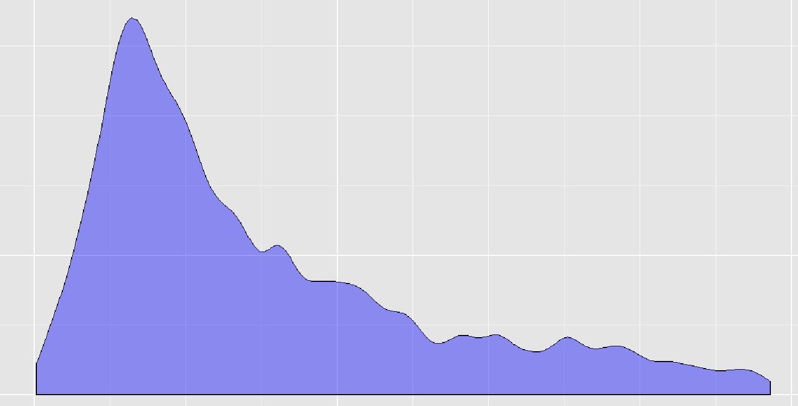

Treating outliers
====

### Introduction
Outliers are the extreme values that a variable has, depending on the model or requirement, it could be necessary to treat them, either transforming or deleting.

### Variable "Income" distribution

This is going to be our main variable in this example, whose represents customer's income in $. We can observe how there are a few cases with very high values, while on the other hand, there are lots of cases with low/mid values.

#### If we choose to delete them...
A common question is: "How many cases do we have to leave out?", we can choose to leave out highest 1%, so we will obtain:

Now distribution looks very similar to last one, except now it reaches $300.000 instead of $500.000.

If we do this process **iteratively** -deleting highest 1%, and then to that result, we delete again highest 1%, and so on, repeating this process 10 times- we're analyzing different cut-off values in order to leave out extreme values. We obtain a curious result,  **silhouette remains always similar to**:

 
 

#### Animating the example
Following animation shows in action this iterative deleting process:
As we leave out highest 1%, silhouette keeps a similar aspect to:

In other words, there is _always_ lots of people with low/mid income, and just a few with high income -because of distribution nature-.
Axis values change within each iteration.
 

If we change the histogram plot, by a **density** one, the result is more similar to _zoom_ on the data left side:

_**When we delete the lowest or highest values of any variable, what we are doing is a "zoom" to the area when most cases are.**_

 
 

#### Final thoughts
In this particular case, we could choose to leave out highest 0.5 or 1% of data. However this is not always recommended to delete all outliers, sometimes they represents valuable information such as fraud or a machine failure, or any other event whose deserves further inspection.

 

#### Contact
R code and data available on [github](https://github.com/pablo14/outliers_treatment)

Outliers issues and data treatment are topics of the **e-learning course: [Data Science with R](http://datascienceheroes.com/learning.html)** (request free demo in info@datascienceheroes.com)
